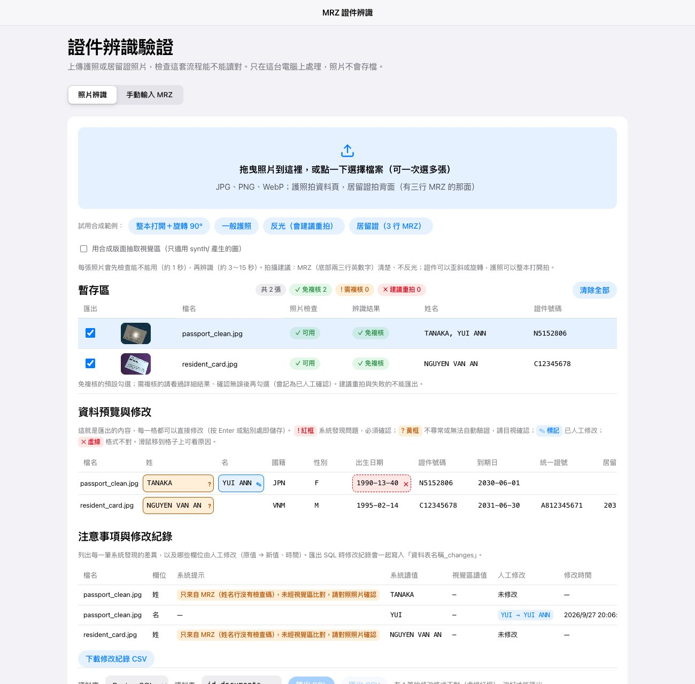

# 證件 MRZ 辨識系統

拍一張護照或居留證的照片，自動讀出 MRZ（證件底部的機器可讀區），驗證檢查碼、判斷要不要人工複核，
最後打包成可以直接匯入資料庫的 SQL。支援 9 國／地區護照與台灣居留證，**不需要訓練任何模型**。

**線上展示**：https://mrz-id-recognition.vercel.app （請用網站上的合成範例圖試用，勿上傳真實證件）



## 做得到什麼

- **整本打開、歪斜、旋轉都能讀**：先在照片中直接找 MRZ（2～3 行等寬字），再依 ICAO 9303 的字距（每字 2.54 mm）推算資料頁範圍並轉正；也會嘗試傳統的四角點偵測，兩者擇優。
- **防偽底紋上的 MRZ**：實拍護照的波浪底紋會讓 Tesseract 把一長串 `<` 讀成 `KKKK…`。MRZ 是等寬字型，所以依字形逐格判斷 `<`、以動態規劃把 OCR 結果對齊到格子，再逐段重讀。
- **不會把讀錯的判成成功**：姓名行沒有檢查碼，所以多種前處理逐字投票，各次讀法不一致就送複核；第二行依位置的字元類型分段重讀，只有通過的檢查碼變多才採用。
- **台灣護照視覺區**：用 PP-OCR 讀整頁文字，再依欄位標籤（「出生日期／Date of birth」等）找正下方的值，不依賴固定座標，斜拍也讀得到。英文姓名、護照號碼、身分證字號、出生日期、到期日、性別都和 MRZ 交叉比對；發照日期以 5／10 年效期檢查；中文姓名無法用 MRZ 驗證，網頁會提示人工確認。
- **上傳前先檢查照片能不能用**（約 0.5 秒）：找不到 MRZ、太模糊、反光、解析度不足、**斜拍太嚴重**、**MRZ 上有陰影**就說明怎麼重拍。逆光、偏暗的照片辨識時會自動做局部對比增強與光照壓平。斜拍程度由 MRZ 字形量測（OCR-B 字高與字距的比例、字距由一端到另一端的漸變），門檻依模擬各種傾斜後實際辨識的結果訂定：左右斜約 25～30°、上下斜約 43° 以上判定不適用。
- **批次處理＋暫存區**：一次上傳多張，確認後勾選要入庫的筆數。
- **匯出前預覽與修改**：以表格顯示要匯出的資料，紅框是系統發現的問題（檢查碼、視覺區與 MRZ 不一致）、黃框是不尋常或無法自動驗證（已過期、只來自 MRZ 的姓名、中文姓名），每一格都能直接修改；格式不對的修改會擋住匯出。每次修改都記入修改紀錄（原值 → 新值、時間、當時的系統提示），可下載 CSV，匯出 SQL 時寫入「資料表_changes」。
- **匯出 SQL**：PostgreSQL／MySQL／SQL Server／SQLite。資料表不存在自動建立，已存在就寫入；同一張照片重複匯入會更新，不會重複新增；人工修改紀錄另存一張表，只新增不覆蓋。

支援證件：日本、中國、香港、韓國、越南、印尼、菲律賓、印度、台灣護照（TD3，2 行 × 44 字）；
台灣居留證與就業金卡（TD1，3 行 × 30 字，統一證號取自選用資料欄）。

## 成效（合成資料 80 張，8 國各 10 張）

| 版本 | MRZ 讀到 | 檢查碼通過 | 欄位全對 | 讀錯卻判為免複核 |
|---|---|---|---|---|
| 最初 | 63 | 51 | 41 | 13 |
| 模糊前處理、姓名投票、國家碼校正 | 64 | 63 | 55 | 7 |
| 加入視覺區交叉比對 | 64 | 63 | 55 | 0 |
| 陰影背景與超出畫面的角點偵測 | 80 | 73 | 67 | 0 |
| 字形校正、MRZ 定位、第二行分段重讀 | 80 | 75 | 68 | 0 |
| OCR 改讀精確裁切的 MRZ | 80 | 75 | 72 | 0 |
| 光線補救前處理（CLAHE、壓平光照；目前） | 80 | 78 | 72 | **0** |

合成資料使用通用示意版面，分數不代表真實證件的表現；實拍照片（兩本台灣護照、6 種旋轉角度）全部讀對。

## 流程

```
照片 ─→ 品質檢查 ─→ 拉正（四角點 或 MRZ 定位推算資料頁，0°/180° 以檢查碼決定）
     ─→ MRZ OCR（多種前處理 × 裁切範圍、字形校正、姓名逐字投票）
     ─→ 解析與檢查碼（TD3 / TD1、國家碼與身分證字號校驗）
     ─→ 版型路由 ─→ 視覺區讀取與交叉比對（台灣護照：PP-OCR＋欄位標籤）─→ 是否需要人工複核
     ─→ 暫存區 ─→ CSV / SQL
```

## 本機執行

```bash
python3 -m venv .venv && .venv/bin/pip install -r requirements-local.txt
brew install tesseract cmake
scripts/build_opencv.sh          # 編譯不含 FFmpeg 的精簡 OpenCV（原因見 THIRD_PARTY_NOTICES.md）
.venv/bin/python serve.py        # http://127.0.0.1:8000，只接受本機連線、照片不存檔
```

其他指令：

```bash
.venv/bin/python -m unittest discover -s tests                     # 測試（47 個）
.venv/bin/python -m synth.make_dataset --n 50 --out data/synth      # 產生合成資料
.venv/bin/python run.py data/synth/images --out out --synth-layout  # 批次辨識
.venv/bin/python evaluate.py data/synth/annotations.jsonl out/records.jsonl
```

## 部署到 Vercel

已連結 GitHub：推送到 `main` 會自動部署到正式網站，其他分支會產生預覽網址。自行部署時，在 Vercel 匯入這個 repo 即可，設定都在 `vercel.json`：所有路徑轉到 `api/index.py`（沿用 `serve.py` 的處理邏輯），
相依套件用 `requirements.txt`。雲端無法安裝 `tesseract` 指令，所以改用內含 Tesseract 引擎的 `tesserocr`
（`idpipe/tess.py` 自動切換；兩種方式在 80 張合成資料上的結果完全相同），英文模型放在 `tessdata/`。
瀏覽器上傳前會把照片縮到長邊 2400 像素，避開雲端函式的請求大小上限。

## 程式結構

| 路徑 | 內容 |
|---|---|
| `idpipe/pipeline.py` | 主流程；各階段是可替換的函式 |
| `idpipe/mrz.py` | TD3 / TD1 解析、檢查碼、OCR 混淆修正 |
| `idpipe/locate.py` | 在照片中找 MRZ、推算資料頁 |
| `idpipe/detect.py` | 四角點偵測（陰影背景、角點超出畫面） |
| `idpipe/ocr.py`・`chevron.py` | MRZ OCR、字形校正、姓名投票 |
| `idpipe/quality.py` | 照片品質快速檢查 |
| `idpipe/sqlexport.py` | SQL 匯出（四種資料庫） |
| `idpipe/tess.py` | Tesseract 轉接層（pytesseract / tesserocr） |
| `idpipe/templates.py`・`router.py`・`viz.py` | 版型、路由、視覺區抽取 |
| `idpipe/ppocr.py`・`vizlabels.py`・`models/ppocr/` | PP-OCR 推論（只用 onnxruntime）、以欄位標籤讀視覺區 |
| `synth/` | 合成資料產生器（捏造身分、SPECIMEN 浮水印、拍攝條件擴增） |
| `serve.py`・`web/` | 驗證網站（本機）；`api/index.py` 為 Vercel 入口 |

## 限制與注意事項

- 這套系統只**擷取資料**，不驗證證件真偽（不讀晶片、不檢查防偽特徵、不比對人臉），結果需保留人工複核。
- 視覺區目前只有台灣護照啟用（實拍 4 張驗證）；其他國家的姓名只來自 MRZ，之後依各國標籤逐一加入。
- 公開網站會把照片傳到雲端處理（只在記憶體中、不儲存）；真實證件屬於個人資料，請在本機或公司內部部署處理。
- 本專案不含任何真實證件影像；`data/synth/` 與 `web/samples/` 全為合成資料。

## 授權

第三方元件與授權見 [THIRD_PARTY_NOTICES.md](THIRD_PARTY_NOTICES.md)。
